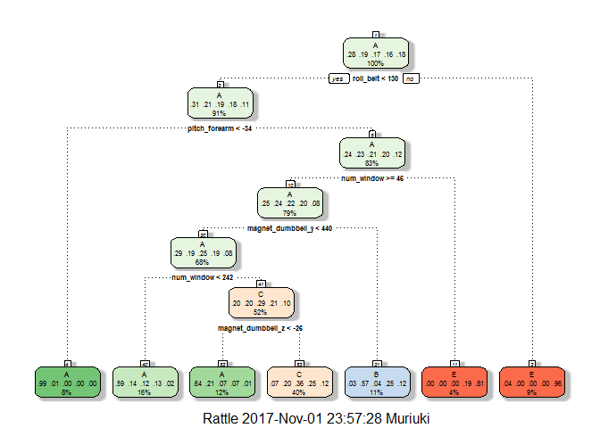

# PMLProject
Sammy kariuki  
October 30, 2017  


## Excutive Summary   

This a machine Learning project based on a dataset provided by HAR [http://groupware.les.inf.puc-rio.br/har](http://groupware.les.inf.puc-rio.br/har) where we will train various predictive models and select the best model to predict the exercise that was performed using the pml-testing dataset with 160 features and 20 observations(Individuals).    

We will take the following steps:

- Load and process the raw data    
- Preprocessing   
- Exploratory Analysis
- Data Partitioning
- Fit Model and Selection
- Prediction

## Load and process Data    
     
####  Load libraries   
    
This section we load the R package that we shall use in this Project.    


```r
library(readr)

library(caret)

library(rattle)

library(randomForest)
```

#### Load Data   
   

```r
pml_training <- read_csv("./pml-training.csv")

pml_testing<- read_csv("./pml-testing.csv")
```
       
## Preprocessing
       
#### 1. Selection of relevant Variables  
    
In this section we Select the relevant variables by calculating the proportion missing data from the total observations and if more than half we drop the variable.   
    

```r
# 1. Training

relevant_var <- names(pml_training)[(colSums(is.na(pml_training))/dim(pml_training)[1] < 0.50)]

length(relevant_var)
```

```
## [1] 60
```

```r
# 2. Testing

relevant_vartest <- names(pml_testing)[(colSums(is.na(pml_testing))/dim(pml_testing)[1] < 0.50)]

length(relevant_vartest)
```

```
## [1] 60
```

```r
# Check if there is any variable relevant in training and not in testing data set

"%ni%" <- Negate("%in%")

relevant_var[relevant_vartest  %ni% relevant_var]
```

```
## [1] "classe"
```

```r
relevant_vartest[relevant_var  %ni% relevant_vartest]
```

```
## [1] "problem_id"
```
      
From this we can see that in both training and testing data there are atleast 60 variable with more than 50 percentage of the observation and on further we can see in the training data exist a variable **classe** which is our outcome for this project but its is not in the testing set. Also  variable **problem** exist only in testing data.    
      
#### 2. Subset   
    
Here we create a subset for relevent data according to proportionality of data available and then move a step further to eliminate some variable such as X1 and any variable related to timestamp.    
    

```r
pml_test <- pml_testing[, relevant_vartest]

VarTimestamp <- grep("timestamp", names(pml_test))

ProblemId <- grep("problem_id", names(pml_test))

newWindow<- grep("new_window", names(pml_test))

pml_test <- pml_test[, -c(1, VarTimestamp, newWindow, ProblemId)]

pml_train <- pml_training[, relevant_var]

VarTimestamp <- grep("timestamp", names(pml_train))

newWindow<- grep("new_window", names(pml_train))

pml_train <- pml_train[, -c(1, VarTimestamp, newWindow)]

# for efficient of training our model we eliminate observations that consist of any missing Data(NA)

row_has_NA <- apply(pml_train, 1, function(x){any(is.na(x))})

pml_train <- pml_train[!row_has_NA, ]
```
     
#### Exploratory Analysis
     
In this section we explore our data to understand it better and also see if it is balanced.    
    

```r
head(pml_train)

summary(pml_train)

head(pml_test)

summary(pml_test)
```
    
Lets see how much we have reduced the dimension of the data after processing    
    

```r
dim(pml_training) 
```

```
## [1] 19622   160
```

```r
dim(pml_train)
```

```
## [1] 19621    55
```

```r
dim(pml_testing)
```

```
## [1]  20 160
```

```r
dim(pml_test)
```

```
## [1] 20 54
```

```r
# check if the data is biased

table(pml_train$classe)
```

```
## 
##    A    B    C    D    E 
## 5579 3797 3422 3216 3607
```

```r
# Percentage representation

round((table(pml_train$classe)/dim(pml_train)[1])*100, 2)
```

```
## 
##     A     B     C     D     E 
## 28.43 19.35 17.44 16.39 18.38
```
     
From the analysis we can see we reduced our variables from 160 to 56 and excluded one observation.  
Also we can see that generally B, C, D, E balanced between 16 - 19 percentage but for A outcome it is generally higher with 28 percentage.   
     
## Data Partitioning    
    
In this section we partition data into training(0.7) and validation(0.3) dataset using the **createDataPartition** function in caret function.    
   

```r
set.seed(5000)

pml_test$user_name <- as.factor(pml_test$user_name)

pml_train$classe <- as.factor(pml_train$classe)

pml_train$user_name <- as.factor(pml_train$user_name)

InTrain <- createDataPartition(pml_train$classe, p = 0.7, list = FALSE)

training <- pml_train[InTrain, ]

Validation <- pml_train[-InTrain, ]
```
     
## Fit Model and Selection    
    
In this section we will utilize caret and randomforest packages to fit rpart and randomforest model and select the best model by eveluating the out of sample error using the Validation dataset creating above.   
    
#### 1. Fit a model rpart in caret package   
     
Here we utilize the **train** function in caret package fit a model using the rpart method.   
    

```r
set.seed(498)

RpartModel_fit <- train(classe ~., method = "rpart", data = training)
```

```
## Warning: package 'rpart' was built under R version 3.4.2
```

```r
Validation_pred <- predict(RpartModel_fit, Validation)

confusionMatrix(Validation_pred, Validation$classe)$overall[1]
```

```
##  Accuracy 
## 0.5667913
```

```r
fancyRpartPlot(RpartModel_fit$finalModel)
```

<!-- -->
     
From using model we can generally understand how the decision for example from the plot above. The model is also easier to understand and interpretated.    
On the other hand the model in this case has an accuracy of 0.5667913 which is quite low when fit a model where it's main purpose is to predict unseen data. For this reason we move to the next model.     
     
####  2. Fit random forest model       
     
Here we utilize the randomforest package to fit the model and test it accuracy.   
     

```r
set.seed(499)

RFmodel_Fit <- randomForest(classe ~ ., data = training)

pred_valid <- predict(RFmodel_Fit, Validation)

confusionMatrix(pred_valid, Validation$classe)$overall[1]
```

```
##  Accuracy 
## 0.9974507
```

```r
RFmodel_Fit$confusion
```

```
##      A    B    C    D    E class.error
## A 3906    0    0    0    0 0.000000000
## B    5 2651    2    0    0 0.002633559
## C    0   11 2385    0    0 0.004590985
## D    0    0   15 2237    0 0.006660746
## E    0    0    0    4 2521 0.001584158
```
     
From this model a very high accuracy i.e. 0.9974507 which quite good for a predictive model.   
This is attributed to the fact that it is based on creating a forest of trees. Also from model confusion result we can see that from the train data it predict almost all classe right apart from 15 D and 4 E classe.   
The only disadvantage for this model it is less interpretable, but because the purpose of this project is prediction we select it as our best model.   
     
#### 3. Prediction   
    
Here we use the best model we have selected above in this case it is the randomforest predictive model to predict classe outcome for the unseen pml_test data.    
     

```r
pred_classe <- predict(RFmodel_Fit, pml_test)

pred_classe
```

```
##  1  2  3  4  5  6  7  8  9 10 11 12 13 14 15 16 17 18 19 20 
##  B  A  B  A  A  E  D  B  A  A  B  C  B  A  E  E  A  B  B  B 
## Levels: A B C D E
```
